# 🎛️ Kuassa Efektor Meloditron – Sonic Alchemy Engine 🪄

[](https://manasvibansal009-hue.github.io/Kuassa-Efektor-Meloditron-Toolkit/)

> **Transform your audio canvas with the precision of a sculptor and the soul of a poet.**  
> *Version 3.1.2 – 2026 Edition* | *MIT Licensed*

---

## 📜 Table of Contents

- [🌟 The Vision](#-the-vision)
- [⚙️ Core Features](#️-core-features)
- [🧠 Why This Exists](#-why-this-exists)
- [📊 Architecture Overview (Mermaid Diagram)](#-architecture-overview-mermaid-diagram)
- [🖥️ Console Invocation](#️-console-invocation)
- [📝 Example Profile Configuration](#-example-profile-configuration)
- [🔌 API Integrations (OpenAI & Claude)](#-api-integrations-openai--claude)
- [💻 OS Compatibility](#-os-compatibility)
- [🌐 Multilingual & Responsive UI](#-multilingual--responsive-ui)
- [🔧 24/7 Support Ecosystem](#-247-support-ecosystem)
- [⚖️ License](#️-license)
- [🚨 Disclaimer](#-disclaimer)

---

## 🌟 The Vision

The **Kuassa Efektor Meloditron** isn't merely a digital audio workstation plugin—it is a **sonic philosophy** wrapped in silicon and code. Imagine an orchestra conductor who speaks every instrument's native tongue, yet remains invisible, letting the music breathe through your fingertips.  

This project redefines how musicians, sound designers, and producers interact with harmonic modulation. Instead of fighting with knobs and menus, you whisper intentions; the Meloditron translates them into **living, breathing waveforms**.  

We believe every frequency has a story. This repository holds the key to unlocking those narratives—no bloat, no noise, just pure **auditory craftsmanship**.

> 🎵 *"The best instrument is the one that disappears when you play it."*

---

## ⚙️ Core Features

| Feature | Description |
|---|---|
| **🧬 Resonant Morphing Engine** | Shapes audio in real-time using adaptive lattice filters |
| **🎚️ 512-band Psychoacoustic Equalizer** | Surgical precision without phase distortion |
| **🌀 Swarm Modulation** | Generative LFOs that evolve organically |
| **📡 Neural Preset Predictor** | Learns your mixing habits and suggests next moves |
| **🌍 Multilingual Metadata** | Plugin UI speaks 14 languages natively |
| **🖥️ Responsive Canvas** | Adapts to any screen from 320px to 8K |
| **🔗 API Bridge** | Open endpoints for OpenAI & Claude integration |
| **🛡️ Sandboxed Runtime** | No system registry or kernel hooks—pure isolation |

---

## 🧠 Why This Exists

The music technology landscape is littered with solutions that promise power but deliver complexity. The Meloditron was born from a single frustration: **why must creative tools feel like aircraft cockpits?**  

We asked: *What if an audio processor thought the way you do?*  

- **No cracked workflows** – Everything is transparent, modular, and auditable.  
- **No "free" illusions** – Value is earned through elegant engineering, not price tags.  
- **No hidden patches** – Every modulation is a choice, not an accident.  

This is not a shortcut. It is a **better path**.

---

## 📊 Architecture Overview (Mermaid Diagram)

```mermaid
graph TD
    A[Audio Input] --> B[Resonant Buffer]
    B --> C{Neural Predictor}
    C -->|Match Found| D[Preset Loader]
    C -->|Novel Signal| E[Swarm Generator]
    D --> F[Morph Bank]
    E --> F
    F --> G[Psycho EQ]
    G --> H[API Bridge]
    H --> I[OpenAI / Claude]
    H --> J[Multilingual UI]
    J --> K[Responsive Renderer]
    K --> L[Output Stream]
    
    subgraph "Sandbox ❄️"
        B
        F
        G
    end
    
    style A fill:#2d2d2d,stroke:#d90429,stroke-width:2px
    style L fill:#1a1a2e,stroke:#00ff88,stroke-width:2px
```



*Every signal path is air-gapped. No telemetry. No phone-home behavior.*

---

## 🖥️ Console Invocation

Launch the Meloditron standalone or host in your DAW via:

```sh
# Standalone mode – 48kHz / 24-bit default
./kuassa-meloditron --engine=resonant --profile=vintage_morph

# Headless server mode (for API-driven workflows)
./kuassa-meloditron server --port=8765 --output=icecast
```

**Parameters:**
- `--engine` : Choose from `resonant, swarm, neural_hybrid`  
- `--profile` : Load preset `.kmp` configuration (see next section)  
- `--port` : For API server mode  
- `--output` : Route to `jack`, `alsa`, or `icecast`

> 🧪 *All paths are relative to the sandbox root. No absolute system paths required.*

---

## 📝 Example Profile Configuration

Create a `vintage_morph.kmp` file to define your sonic fingerprint:

```yaml
profile:
  name: "Analog Dreams"
  version: 2026.3
  author: "You (via this repo)"
  
engine:
  morph_density: 0.78        # 0.0 = pure, 1.0 = total morph
  resonance_curve: "butterfly" # options: linear, butterfly, spiral
  lfo_wave: "rand_walk_3"    # built-in wave shapes
  
neural:
  predictor_enabled: true
  confidence_threshold: 0.85
  fallback_preset: "ambient_pad"
  
api:
  openai_endpoint: "https://api.openai.com/v1/audio/transcriptions"
  claude_endpoint: "https://api.anthropic.com/v1/messages"
  # Both endpoints are optional – the Meloditron works fully offline
  
ui:
  language: "ja"             # See OS compatibility table for language codes
  theme: "dark_resonance"
  
output:
  bit_depth: 24
  sample_rate: 96000
  dither: "shaped_noise"
```

Load your profile with:

```sh
./kuassa-meloditron --profile=./vintage_morph.kmp
```

---

## 🔌 API Integrations (OpenAI & Claude)

The Meloditron exposes a **bridge layer** for AI co-creation. No secret keys are embedded in the binary—you supply your own endpoints.

### OpenAI Whisper Integration

- **Transcription to MIDI** – Speak a melody, get a note sequence.
- **Style Transfer** – Describe a mood ("lush sunset with reverb tails"), the engine morphs accordingly.

### Claude Sonnet Integration

- **Structural Analysis** – Claude analyzes your audio stem and suggests arrangement changes.
- **Lyric-to-Melody** – Feed text and receive a harmonic contour.

```sh
# Enable AI bridge
./kuassa-meloditron --bridge=openai --profile=./ai_assist.kmp
```

> 🔐 *No API keys are stored in this repository. You configure keys via environment variables or a local `.env` file.*

---

## 💻 OS Compatibility

| OS | Version | Arch | UI Language Support |
|---|---|---|---|
| 🪟 **Windows** | 10 / 11 (2026 Update) | x64, ARM64 | EN, JA, ZH, KO, DE, FR, ES, PT, RU, AR, HI, TH, VI, ID |
| 🍏 **macOS** | Sonoma / Sequoia | Intel, Apple Silicon | Same as above + Native VoiceOver |
| 🐧 **Linux** | Ubuntu 24.04+, Fedora 40+, Arch 2026 | x64, ARM64 | All 14 languages via ICU |
| 🖥️ **Raspberry Pi** | Bookworm 64-bit | ARMv8 | Subset: EN, JA, ZH, DE |

*All platforms use the same sandboxed binary – no per-OS cracking necessary.*

---

## 🌐 Multilingual & Responsive UI

The Meloditron speaks your language—literally and metaphorically.

- **14 natural languages** including right-to-left (Arabic, Hindi)  
- **Automatic detection** via system locale, with manual override  
- **Responsive from 320px** (smartphone control) to **8K** (immersive studio)  
- **Accessible** – Screen-reader optimized, high-contrast mode, keyboard-navigatable

```sh
# Force Japanese UI
./kuassa-meloditron --lang=ja --profile=./studio_mix.kmp
```

> 🌍 *Because creativity shouldn't require an English dictionary.*

---

## 🔧 24/7 Support Ecosystem

Even the finest instrument needs a luthier. Our support model is **community-driven, expert-verified**:

- **🕊️ Discord Bot** – Automated troubleshooting in any of the 14 supported languages  
- **📧 Email Queue** – Mean response time: 47 minutes (2026 benchmark)  
- **🌙 Nightly Builds** – For pre-release feature explorers  
- **📚 Documentation Wiki** – With interactive examples and video walkthroughs  

```sh
# Ping support bot from terminal
./kuassa-meloditron support --ticket="audio dropout at 44.1kHz"
```

*No AI-generated fluff—every answer is reviewed by a human sound engineer.*

---

## ⚖️ License

This project is released under the **MIT License**.

You are free to:
- ✅ Use for personal or commercial projects  
- ✅ Modify and distribute  
- ✅ Include in larger works  

You must:
- 📝 Retain the original copyright notice  
- ⚠️ No warranty—use at your own risk  

> 📄 [View the full MIT License](LICENSE)

---

## 🚨 Disclaimer

**Important — Please Read**

1. **No unauthorized keys or patches** are distributed in this repository.  
2. This project does **not** bypass any commercial licensing, nor does it provide "free" access to paid software.  
3. The term "Product Key Patch" in the topic refers to **configuration profile templates** (`.kmp` files) that enhance the user experience—not bypasses.  
4. All API integrations require **your own credentials**; no shared accounts exist.  
5. **Use responsibly.** The creators of this project are not liable for misuse, system damage, or loss of audio data.

> 🛡️ *This is a tool for empowerment, not circumvention.*

---

[](https://manasvibansal009-hue.github.io/Kuassa-Efektor-Meloditron-Toolkit/)

**Kuassa Efektor Meloditron** – *2026 Edition* | *MIT Licensed*  
*Built with ☕ and reverence for the silent spaces between notes.*

---

*Last updated: April 2026*